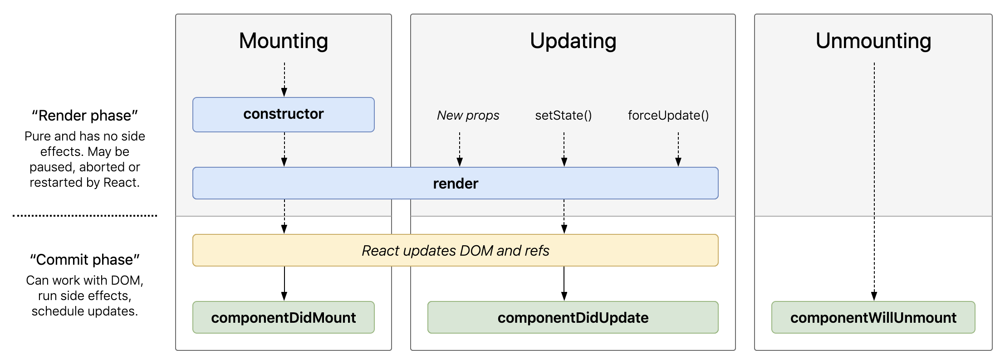

# React Component Lifecycle

## Getting Started

To get started you must first clone this repo to your computer.

`git clone git@github.com:aaronholla/react-component-lifecycle.git`

Next be sure to run `yarn` to install the dependencies.

> If you would like to reference the final application switch over to the `final` branch.

## React Component

### What exactly is a React Component? 
A Component is a small reusable container(instance) that holds the state, props, and the React elements that represent the component. 

In practice this means components are a class instance that extends React.Component or a function that takes in props and returns React elements. Classes can also store state that represents the data for that component for itself to reference and update. 

> Function components now have a way to pull in state called hooks, however, they handle lifecycle a little bit differently so we will only be focused on class components for now.  

### What are React Elements?

The elements of the component are simply a JavaScript object that represents what the component should display on the screen. The type of elements can be a DOM element such as a div or it can be another component. React will know to go to that component to figure out what DOM element needs to be displayed.

```js
{
  type: 'button',
  props: {
    className: 'button button-blue',
    children: {
      type: 'b',
      props: {
        children: 'OK!'
      }
    }
  }
}
```

Is the same as this HTML:

```html
<button class='button button-blue'>
  <b>
    OK!
  </b>
</button>
```

## Stages of a Components Life

[](http://projects.wojtekmaj.pl/react-lifecycle-methods-diagram/)

There are three main stages to a react component. Mounting, Updating, and Unmounting.

React components start out unmounted. 

### Mounting
The first stage of a react component is mounting. Mounting is whenever a component gets rendered to the DOM for the first time. This is where React will setup the instances for each component that stores any state and its initial props. 
### Updating
A component will enter into the updating state if it is mounted and a new prop is passed in or setState is called inside the component. 
### Unmounting
A component will be unmounted when it is no longer part of the DOM. This can happen if a parent component conditionally rendering a child. 


## Lifecycle Methods

Lifecycle methods are a way for us to hook into the different events that React will trigger on our components. The most popular of these events is after it is first created in the dom, when props or state are changed, and before it is removed from the dom.

### constructor
Used to initialize a component with state or bind methods to the component instance. components are not mounted when this is called. Cannot set state on unmounted components. This means that you cannot call setState inside the constructor

### componentDidMount
called after the component is mounted, can update state here if you need to and access any dom elements that you may need or make any network requests. 

### render
called when it needs to put something on the screen. Called when it initially renders as well as when a new prop is passed in or setState is called. Render is called before the component is mounted or changes reflected in the dom. You can think of render the same as staging changes in git. Render will stage the changes and then react will update the dom to match these changes.

### componentDidUpdate
called after a component is updated, can update state here if needed and make network requests. Good if you need to update state based on if a prop changed or make a network request with new props/state. You should check current props against prevProps inside componentDidUpdate if you are going to setState otherwise it will cause an infinite loop because it will constantly update the component.

### componentWillUnmount
called right before the component is unmounted. This is good for when you need to clean up anything the component may leave behind, such as clearing timers or canceling network requests. You should not call setState here as the component will not be rerendered. Once a component is unmounted it will never be mounted again.


## References 

- https://reactjs.org/docs/react-component.html  
- https://blog.logrocket.com/the-new-react-lifecycle-methods-in-plain-approachable-language-61a2105859f3/  
- http://projects.wojtekmaj.pl/react-lifecycle-methods-diagram/
